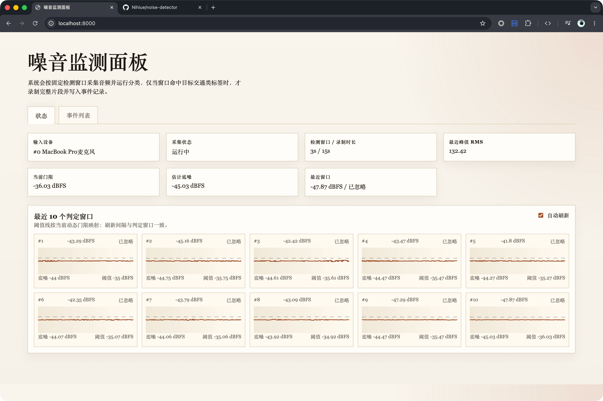
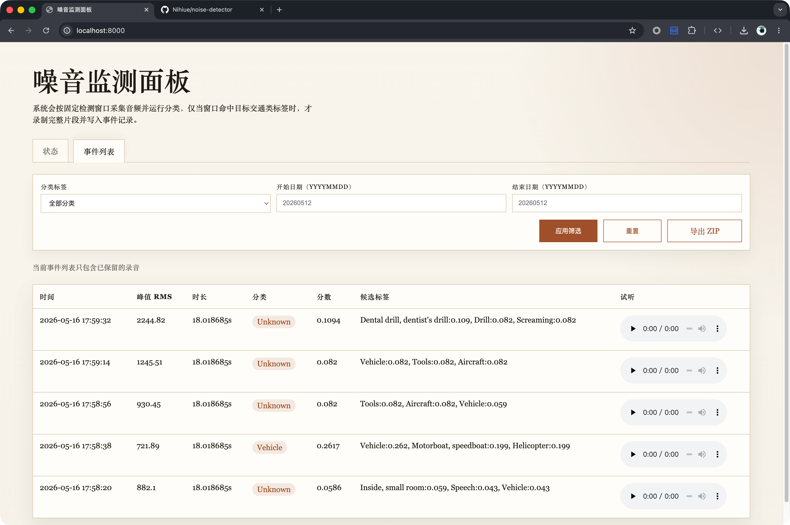

# noise-detector

基于 YAMNet 的本地噪音监测系统，用于从真实音频输入设备持续采集环境声音，识别并保留目标噪音事件。






## 1. 功能介绍

`noise-detector` 的目标是降低长时间人工监听成本：服务持续监听麦克风输入，启动时先采集一个判断窗口作为底噪样本，并用样本 RMS 均值和标准差计算分类阈值，再把高于阈值的音频窗口交给 YAMNet 分类。只有命中目标标签的事件才会录音、入库和展示。

主要功能：

- 持续采集真实音频输入设备。
- 启动时采集一个判断窗口作为底噪样本，按 `RMS 均值 + K 个标准差 + 固定偏移量` 计算阈值并过滤低价值音频，`K` 由 `detection.threshold_stddev_multiplier` 配置，固定偏移量由 `detection.threshold_rms_offset` 配置。
- 对通过门控的检测窗口直接运行 YAMNet 分类。
- 只保留 `classification.retained_labels` 命中的事件录音。
- Web UI 展示运行状态、当前底噪、当前阈值、最近 10 个判定窗口波形和事件列表；波形图使用 ECharts 时间轴渲染，并支持手动重新校准阈值。
- 事件列表支持按分类、日期范围筛选。
- 支持导出当前筛选结果对应的 ZIP，包含事件 JSONL 和录音文件。

检测结果含义：

- `已忽略`：音量未达到当前校准阈值，未进入 AI 分类。
- `已校准`：该窗口被用作底噪样本并刷新阈值，不进入 AI 分类。
- `已检测`：已进入 AI 分类，但分类结果未命中保留标签。
- `已记录`：分类命中保留标签后进入录制期；触发窗口和录制期窗口都会标记为已记录，录制完成后录音会保存并写入事件库。

## 2. 使用方式

安装依赖(需要 Python 3.9 ~ 3.11)：

```bash
pip install -r requirements.txt
```

启动服务：

```bash
python3 app.py
```

默认 Web 服务监听配置在 [config/default.yaml](./config/default.yaml) 中，启动后访问对应的 `host:port` 即可打开控制台。

查看本机可用输入设备：

```bash
python3 app.py --list-devices
```

手工录音并跑一次分类：

```bash
python3 scripts/record_and_classify.py --seconds 2
```

运行测试：

```bash
python3 -m pytest -q
```

事件元数据保存在 `data/audio-detect.db`，录音文件默认保存在 `data/records`。JSONL 仅作为 ZIP 导出格式使用。

当前限制：

- 分类依赖 LiteRT 运行时包 `ai-edge-litert`。
- 当前只支持真实音频输入设备。
- 配置了 `audio.device_name` 但匹配不到设备，或 `sounddevice` 后端不可用时会直接报错。
- 分类已启用时，如果模型文件或类目映射文件不可用，服务会在启动阶段直接报错，不会以降级模式继续运行。

## 3. 开发者文档

技术架构、主要实现和测试说明见 [dev.md](./dev.md)。
